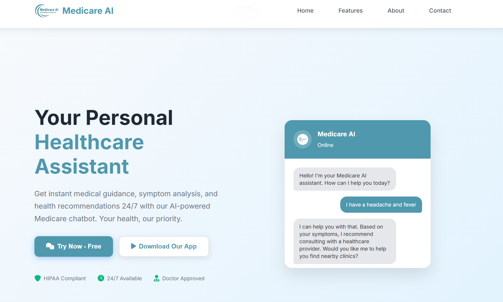
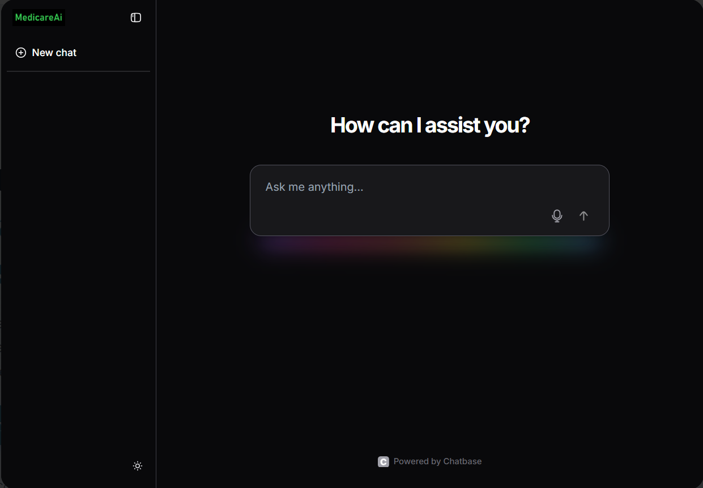
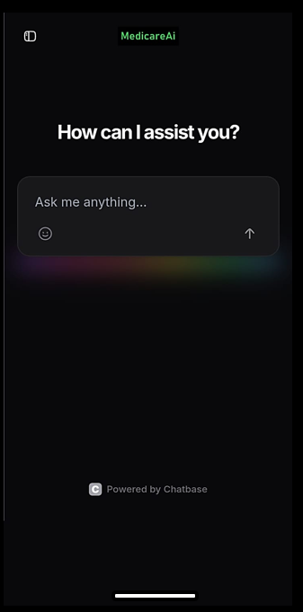

# 🩺 Medicare-AI – Preventive Healthcare Assistant

Medicare-AI is an AI-powered healthcare chatbot designed to provide preventive healthcare awareness and basic medical guidance.  
The application helps users understand symptoms, general health advice, and vaccination-related information through a simple and accessible chat interface.

This project aims to support rural and semi-urban populations by providing easy-to-understand healthcare information using AI technology.

---

## 🚀 Live Demo
https://medicare-ai-weld.vercel.app

---

## ✨ Features

• AI-powered chatbot for healthcare-related queries  
• User-friendly and responsive interface  
• Real-time AI-generated responses  
• Works on both desktop and mobile devices  
• Android APK version included  
• Clean and minimal UI design  

---

## 🛠️ Tech Stack

Frontend:
- HTML
- CSS
- JavaScript

AI Integration:
- AI API Integration (Chat-based response system)

Deployment:
- Vercel

---

## 📂 Project Structure

Medicare-ai/
│
├── images/              # Screenshots of the project
├── MedicareAi.apk       # Android APK file
├── index.html           # Main HTML file
├── style.css            # Styling file
├── script.js            # Chatbot logic and API integration
└── README.md            # Project documentation

---

## ⚙️ How It Works

1. User enters a healthcare-related query.
2. The query is sent to the AI API.
3. The AI processes the input.
4. The chatbot displays the response in real time.

---

## 🖥️ Screenshots

(Add your screenshots here)

Example format:

---

## 📦 Installation (Run Locally)

1. Clone the repository:

   git clone https://github.com/Aniket27-web/Medicare-ai.git

2. Open the folder.

3. Open index.html in your browser.

No additional installation required.

---

## 📈 Future Improvements

• Add user authentication  
• Store chat history  
• Add multilingual support  
• Improve AI response accuracy  
• Backend upgrade for scalability  

---

## 👨‍💻 Author

Aniket Yadav  
B.Tech – Information Technology  
Nagpur, Maharashtra  

LinkedIn: (Add your LinkedIn link here)  
Email: aniketyadav274780@gmail.com  

---

## 📄 License

This project is for educational and learning purposes.
